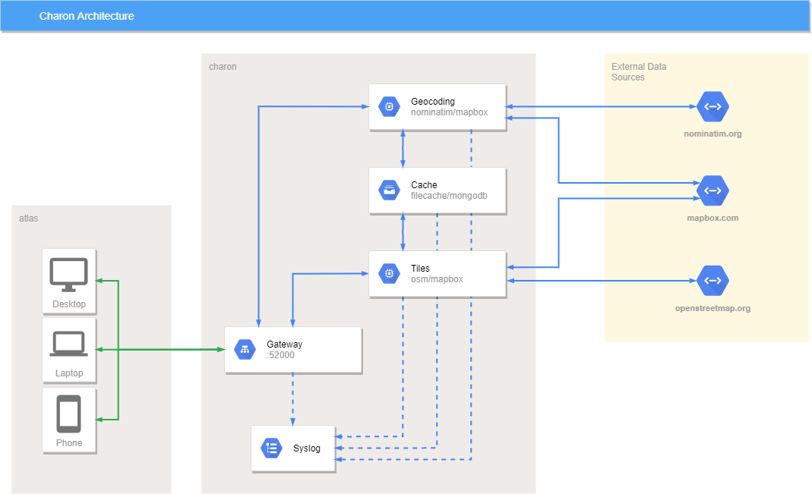

# Charon
[](https://www.codefactor.io/repository/github/chronark/charon)

Backend services for caching and displaying geospatial data


## Getting Started

These instructions will get you a copy of the project up and running on your system. This is intended to run on an ubuntu machine but can be run anywhere you have docker installed.

### Prerequisites

- Make
- Docker

To install docker follow the instructions [here](https://docs.docker.com/install/linux/docker-ce/ubuntu/) or use the install script:
```sh
curl -fsSL https://get.docker.com -o get-docker.sh
sudo sh get-docker.sh
```

### Deployment

There are a couple of steps to run the services.

- 0. Build all necessary docker images if you don't have them alrady.
```sh
make build
```

- 1. Get and initialize Terraform, a infrastructure management and provisioning tool.
```sh
make init
```

- 2. Create a terraform plan
```
make plan
```

- 3. Apply the plan
```
make apply
```

The API gateway will be listening on port 52000.

## Services

<div class="mxgraph" style="max-width:100%;border:1px solid transparent;" data-mxgraph="{&quot;highlight&quot;:&quot;#0000ff&quot;,&quot;lightbox&quot;:false,&quot;nav&quot;:true,&quot;resize&quot;:true,&quot;toolbar&quot;:&quot;zoom layers&quot;,&quot;edit&quot;:&quot;_blank&quot;,&quot;xml&quot;:&quot;&lt;mxfile modified=\&quot;2020-01-27T16:11:20.095Z\&quot; host=\&quot;www.draw.io\&quot; agent=\&quot;Mozilla/5.0 (Windows NT 10.0; Win64; x64) AppleWebKit/537.36 (KHTML, like Gecko) Chrome/79.0.3945.130 Safari/537.36\&quot; etag=\&quot;S1CvywFvutsc3-JTpWvt\&quot; version=\&quot;12.5.8\&quot;&gt;&lt;diagram id=\&quot;f106602c-feb2-e66a-4537-3a34d633f6aa\&quot; name=\&quot;Page-1\&quot;&gt;7V1tk6I4EP41fhwLEoLwcXzbu6q9qqmavbvdT1sIEalB4iHu6P76SyCgJFHRAXRUZ7fGNCGE9PN0Op2G6cDBfP0ldhazv4iHww7QvHUHDjsA6LoF6C8m2WSSno4ygR8HHq+0FbwGvzEXaly6Cjy8LFVMCAmTYFEWuiSKsJuUZE4ck/dytSkJy1ddOD6WBK+uE8rSfwMvmeX3ZdrbA3/gwJ/xS1uglx2YOO6bH5NVxK/XAXCafrLDcydvi9/ocuZ45H1HBEcdOIgJSbJv8/UAh2xs82HLzhvvOVr0O8ZRUuWE37//WU/Xc61vvvR/239HffC2fLJ553454YoPiDtzYhLxPiebfJwWJIiSdKxRn/6j5w2y/4geHTBJFyCFUCXryUJdLcnbLAtVsp4s1FWXFYUqGVAIlRLpspqif5pwI/Qf7KfAwUw1Oi05kyUJVwl+jl3OkFRalChY+rNkHvIDyyQmb3hAQhJTSUQiWqfvx44XUCwI4gJ2Gi14znKWXpQVpiRK8qsBXs5PpmC2R+yHdSMM/IjKQjylQOv/wnESUP48c3FCFuwyC8cNIp+1pW2L39ix4ZPBWg/CcKf10XjUH9lUzvFHG8XrvcjWC75QO4TJHCfxhlbhJ0DEUbzJycvL71tCGwaXzXa4jCwudLgR8Yu2t0SiXziXTuCV1ZN45SQhvcyDVg9afRJa6VqZVlBBq2Ia36UVrINWQCLQgE9MGlXnLEioM7CKsUQoYUCM4bM+RvuUW2hR36/pXX0ast64Sr6mpSHSZI1zr6AEtT26UGhsr3osVNKOIStH10wka8doyuYBJKlsiJdvDMiiksrKoGPkpR9RI1m13C3Tz+J36Exw+EKWQRIQpjaXjjiOdwj3VagwDzyP9bNQtHRGTtEJSRIylzCggICdfhTG4Z0B+ZWeziTv1MPettbnrad3UQedDYHOppmaWQE0PQWhc6jVDxlTgoyElZJx5asAZ5Ie1cqkEqjfQ+znAPUXrI352mcLm67vLkDX43iFfTquSYmrR8b+ACP2aiSd0YThR4rhN3i1GIdOEvwqL1xUOuFXfGG+xfZyBUFzNwl0Bb2S6XSJE0mrRc8/oGjZH/rqLB6m4TpNg4F6Cmi2axms67IMYYbWugxDrxbDAGEzhsFqzzBAXdLzy4zp4WEXrs8uICQ7ma1aBSivCi5qFRaz7GAtRgEeVobKKOTjUQpqaPUYBd0sGwVh2dCgSYCSkkdrSqfIYacOncTpML8RpiviV7KKXfyIqzziKo3GVcbjsTWqTO8jC3erbFVV4UqlWa0lrqKmnHHcrrY4AdcwyIZe9mlMTREfUQWvzMbGWA6PUDsWJhzKHbbFlY+t+d+KbQvRgYBa+tkVmT77/bpZhsTPW6A9yhrJDtY3KSLdMsbwpElxhtd/uswv6i/i7MuQ9tRP6bY7U4puVpwpobqXtYfhRT0hNHeCj/WBSdxQw3KzfxI3DAXV7Vom8TIHnnS7PcfekFf8n9ykQMFuGz2FSbHaNCmGapF8vkn54iT43dnstSmZeBIXEviMgJYb1uuxNm5IVt7PkDjez4kTOpF7H6bH2BNUuDvTgyqsEj+X6UE9wWVULMTbNT1IXqR9yPRg4hKP8bSq8YnIPIgoQOes+85iQtZXZ4bIfEGh8RNH1PfBd2CAMt49DNATkre1Crh2SexLSD0XiurF7cnxyyIqKcUvywtjU4CLnpf5negHYHba5I0jj0dwPm48bVsynqqNT9OUoYikSHh9BlT2j8kCR1TNGCfUoGU4kVyuB3IuiJxiBXBB2Mgufzb7del080DHJdEBTF0xw7WMD1MVZRJQgT0f50NL4mRGfBI54WgrlXyCHRzREXxmaddMvSFx377NgigTj4Mwr7R1kjXJiQZZbd68kR6njlGpLPjmBijASmuqLp8e2OkAXgfJ953vP1hXuoiXhmves7SwyQsRVcD3tKKe7gOlgp0zWXF7aloqnfuC44BqkQE8FWYDz0b7MMKoctJdjKOuFdDobfr4oA9mqjFbSgurZ4dIzA+0NGGxkd0VP2uLa6khcKyh7K6lhupy18wKoaq75UyvMmmAwBkIPw1prNZI0zMFZ9Q+kzS0Q7CLkFZ8QHkyAnYXoEo0othgQb+i2naCVF/ZAuItoIM9FesDSxdYnPWgXk5XyB+6J053Nc0s8RpSq3eQ2LQgcvMA2bPWLkl24wrJLoTtwLkzJO2QXWoJ5vlxDXMb2uAkbkOtBW7no/rgds5tvTxnmy07uipbcRFq79kBaYLawmaglB9Vndq6QG3YDLV10UUwuE1plqtyfuddcrWg3Il04xzPJ9yc4gf5XSP18l3849TbE/t/rDsPcEO1h/bgxuncuHJq7EkJaoIagjtWuGcnU+NYQ01T4wbCmMX2s5wDu8sTNYz1dmHcCjqtmsBpCMsqs227XeGpxZsDJ6iOzsKgF9b9x04TByx6jbCuvGbYl7DZAv7RuUuGYw01jf8biK01aJz3wb9N9GvXh35TyMgxxBcRVIU/gkJqf8U4d23wt+8Q/r2P47/XJgHAFRJAcFsgrIsAIpMaJgCqEH/93Pm1Rd7s5fJrVXGz8/NrB447w6p0MmW27TQIsZudMZ6TyCfeRFLwpZNr03Qe1tFlQmJ25s1n12pqCN9fdu3NPawomh948SeLUL0PK35jPK2c2k+Wj6T+6zE7jwca+SsdH7vO5Wi9kANSHPywd39Nm02m8By5ZHIrO+3iU/9i4lfDTrv12Ig9CF/tCHzPioRWx3x9IZ0Wt5vEkE7x1opTySE11PJ2U/4S85siBzSeLQQ7wmtUWtuWPSX1vkaewKqTSIsbX8KDIr2zc36PNVRTqhAQ3/tlw4P9kurzcWs0s8i6xeyJC3G2Rv6BqmkRLfIPCOtrw5bWDVUpCI831fRcdQOpEbXj/kOPe12OK+j6uFK8FCvfXD43sRUca6ihyUpIa216sqLF7d9wyapv/1AOHP0P&lt;/diagram&gt;&lt;/mxfile&gt;&quot;}"></div>
### Filecache
Discovery name: `charon.srv.filecache`

Filecache is a basic cache that writes or reads bytes to and from the disk.

### Gateway
The HTTP API gateway to interact with all microservices. Exposes various routes to fetch data.
Listens on port 52000
Routes:
- `/geocoding/forward?query=XYZ` calls the geocoding service.
- `/geocoding/reverse?lat=1.0&lon=1.0` calls the geocoding service.
- `/tiles?x=0&y=0&z=0`calls the tiles service.

### Geocoding
Discovery name: `charon.srv.geocoding.nominatim` or `charon.srv.geocoding.mapbox`

Geocoding has two handlers:  [Nominatim](https://nominatim.org/) and [Mapbox](https://www.mapbox.com/)
They both receive a forward or reverse geocoding search and search the cache. In case of a miss they will query their respective 3rd party APIs, write to cache and return the result.

### Tiles
Discovery name: `charon.srv.tiles.osm` or `charon.srv.geocoding.mapbox`

Tiles has two handlers:  [osm](https://openstreetmap.org/) and [Mapbox](https://www.mapbox.com/)
They both receive a tile request and search the cache. In case of a miss they will query their respective 3rd party APIs, write to cache and return the result.


## Built With

* [go](https://golang.org/)
* [docker](https://www.docker.com/)
* [terraform](https://www.terraform.io/) - Infrastructure management
* [go-micro](https://github.com/micro/go-micro) - Microservice framework

## Development

Charon makes use of protobuf for the internal communication. In order to compile the protobuf definition you need to install:
```sh
go get google.golang.org/grpc
go get github.com/golang/protobuf/protoc-gen-go
go get github.com/micro/protoc-gen-micro
```

Then run `make proto` to compile all protobuf definitions at once.